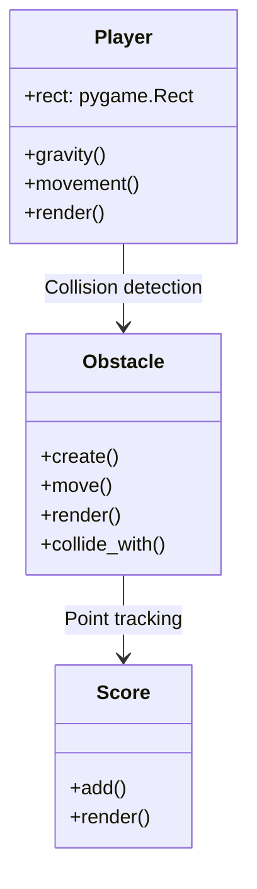

# 🐦 Piccio Bird - Flappy Bird Clone
A Python/Pygame implementation of the classic Flappy Bird game with custom sprites and mechanics.


## 🎮 Features
- **Flappy Bird Mechanics**: Classic tap-to-fly gameplay
- **Obstacle System**: Randomly generated green pipes
- **Scoring**: Digital display with sprite-based numbers
- **Collision Detection**: Precise pipe and ground collision
- **Restart System**: Instant play-again functionality
- **Custom Sprites**: Day theme with yellow bird and green pipes

## ⚙️ Installation
1. **Requirements**:
   - Python 3.8+
   - Pygame 2.0+

2. **Setup**:
```bash
git clone https://github.com/yourusername/piccio-bird.git
cd piccio-bird
pip install pygame
```

## 🕹️ How to Play
```bash
python main.py
```
- **SPACE**: Make bird flap
- **P**: Restart after game over
- **ESC**: Quit game

## 🛠️ Technical Implementation
### Game Architecture


### Key Components
- **Game Loop**: 65 FPS locked update cycle
- **Obstacle Generation**: Randomized pipe positions every 900ms
- **Physics**: Gravity simulation with downward acceleration
- **Rendering**: Alpha-channel surfaces for transparent effects

## 🎨 Customization
### Sprites
Replace these files in `/sprites`:
- `yellowbird-midflap.png`: Player character
- `pipe-green.png`: Obstacle pipes
- `base.png`: Ground texture
- `0-9.png`: Score digits
- `background-day.png`: Game background

### Game Tuning
Adjust in code:
```python
# Physics
self.downforce = -4  # Jump strength
clock.tick(65)       # Game speed

# Obstacles
pygame.time.set_timer(obstacle_timer, 900)  # Spawn interval
obstacle.move() # (Change -= 3 value)       # Pipe speed
```
---
**Contributions welcome!**  
🐛 Report issues | 💡 Suggest features | ✨ Submit PRs
